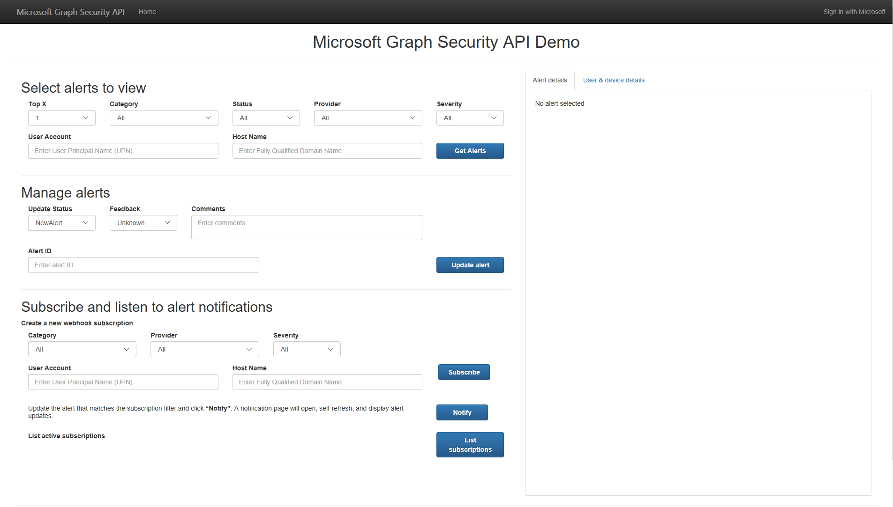
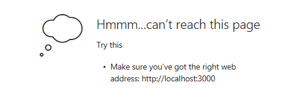
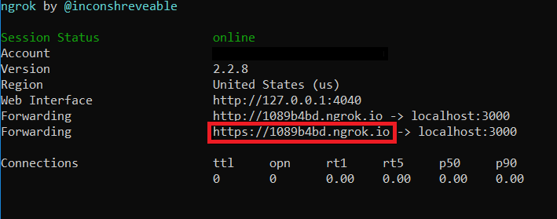

# Microsoft Graph Security API Connect Sample for Node.js

## Table of contents

* [Introduction](#introduction)
* [Prerequisites](#prerequisites)
* [Register the application](#register-the-application)
* [Build and run the sample](#build-and-run-the-sample)
* [Questions and comments](#questions-and-comments)
* [Contributing](#contributing)
* [Additional resources](#additional-resources)

## Introduction

This sample shows how to connect a Node.js app to a Microsoft work or school (Azure Active Directory) or personal (Microsoft) account using the Microsoft Graph API and [the Graph JavaScript SDK](https://github.com/microsoftgraph/msgraph-sdk-javascript) to retrieve security Alerts, and Update an Alert.



## Prerequisites

To use the Microsoft Graph Connect Sample for Node.js, you need the following:

 * [Node.js](https://nodejs.org/) version >=7.6.0.

 * Either a [Microsoft account](https://www.outlook.com/) or a [work or school account](http://dev.office.com/devprogram)

* [Ngrok](https://ngrok.com/download) for webhook notifications.

## Register the application

1. Sign into the [App Registration Portal](https://apps.dev.microsoft.com/) using either your personal or work or school account.

2. Choose **Add an app**.

3. Enter a name for the app, and choose **Create application**. 
	
   The registration page displays, listing the properties of your app.

4. Copy the Application Id. This is the unique identifier for your app. 

5. Under **Application Secrets**, choose **Generate New Password**. Copy the password from the **New password generated** dialog.

   You'll use the application ID and password (secret) to configure the sample app in the next section. 

6. Under **Platforms**, choose **Add Platform**.

7. Choose **Web**.

8. Enter *http://localhost:3000/token* as the Redirect URI.

9. Under **Microsoft Graph Permissions**, choose **Delegated Permissions**, Add **SecurityEvents.Read.All**, **SecurityEvents.ReadWrite.All** and **User.Read.All**. These permissions will allow the sample application to read and modify security events (alerts) and to retrieve information about users from Azure Active Directory via the Microsoft Graph API.

10. Choose **Save**.

## Grant Admin consent to view Security data
### Assign Scope (permission)
1. Provide your Administrator the **Application Id** and the **Redirect URI** that you used in the previous steps. The organization’s Azure Active Directory Tenant Administrator is required to grant the required consent (permissions) to the application.
2.	As the Tenant Administrator for your organization, open a browser window and paste the following URL in the address bar (after adding values for APPLICATION_ID and REDIRECT_URL):
https://login.microsoftonline.com/common/adminconsent?client_id=APPLICATION_ID&state=12345&redirect_uri=REDIRECT_URL.
3.	After authenticating, the Tenant Administrator will be presented with a dialog like the following (depending on the permissions the application is requesting):

     

3. By clicking on "Accept" in this dialog, the Tenat Administrator is granting consent to all users of this organization to use this application. 
Note: Because there is no application currently running at the redirect URL you will be receive an error message. This behavior is expected. The Tenant Administrator consent will have been granted by the time this error page is shown.

    

### Authorize users in your organization to access the Microsoft Graph security API (Assign required Azure role)

To access security data through the Microsoft Graph security API, the client application must be granted the required permissions and when operating in Delegated Mode, the user signed in to the application must also be authorized to call the Microsoft Graph security API.</br>
This section describes how the Tenant Administrator can authorize specific users in the organization.

1. As a Tenant Administrator, sign in to the [Azure Portal](https://portal.azure.com).

2. Navigate to the Azure Active Directory blade.

3. Select **Users**.

4. Select a user account that you want to authorize to access to the Microsoft Graph security API.

5. Select **Directory Role**.

6. Select the **Limited Administrator** radio button and select the check box next to **Security administrator** role

     

7. Click the **Save** button at the top of the page

Repeat this action for each user in the organization that is authorized to use applications that call the Microsoft Graph security API. Currently, this permission cannot be granted to security groups.

## Webhook setup

1. Download [ngrok](https://ngrok.com/download).
2. Follow the installation instructions on the ngrok website.
3. Run ngrok, if you are using Windows. Run "ngrok.exe http 3000" to start ngrok and open a tunnel to your localhost port 3000.
4. Then update the `config.js` file with your ngrok url.

    

## Build and run the sample

1. Download or clone the Microsoft Graph Connect Sample for Node.js.

2. Using your favorite IDE, open **config.js**.

3. Replace the **clientId** and **clientSecret** placeholder values with the application ID and password that you copied during app registration. Replace **notificationUrl** with your ngrok forwarding url.

4. In a command prompt, run the following command in the root directory. This installs the project dependencies.

  ```npm install```

 > **Note:** An error may occur during this process if your
     machine doesn’t have Python 2.7 installed. If the error occurs, the web app will still work.

5. Run the following command to start the development server.

  ```node app.js```

6. Navigate to `http://localhost:3000/` in your web browser.

7. Click the **Sign in with Microsoft** button.

8. Sign in with your personal or work or school account and grant the requested permissions.

9. Select alerts to view by defining filtering criteria and click on the **Get alerts** button. When the operation completes, the alerts matching your filtering criteria will be displayed on the page. The SDK query and REST query used to make the call are also displayed. 
Clicking on the REST query link will open a new tab with the **Graph Explorer** pre-populated with your query.
    >**Note:** The application is retrieving security alerts from your tenant that match the filter criteria. If there are no matching security alerts from the listed providers, "No matching alerts" will be displayed in the response section. To generate sample alerts from Azure Security Center please see [Security Center Alert Validation](https://docs.microsoft.com/en-us/azure/security-center/security-center-alert-validation)

10. In the list of matching alerts, click on the **Title** of a specific alert you want to view. The complete alert details (JSON) will be displayed in the **Alert Details** tab on the right side of the webpage. If the alert contains the **user principal name** or **fully qualified domain name** properties, the application will make an additional call to Azure Actove Directory via the Microsoft Graph API to retrieve additional details about the user account and the device. Click on **User & device details** tab to view additional user and device data, if it exists.
11. To update an alert, enter the Alert ID, choose/enter values for the editable properties, and click on the **Update Alert** button. The **Original alert details** and **Updated alert details** are displayed on the **Alert management** tab on the right side of the webpage.
12. To create a webhooks subscription, select at least one property in any dropdown, or enter a FQDN or UPN. Then click "Subscribe", this will create a webhook subscription. Next click "Notify" to open another page that will display webhook notifications. If a propery matching your webhook subcription resource is updated then a notifiction will be sent to the app and displayed on the notifications page.
    >**Note:** If you are running the sample on your local machine, you should use [ngrok](#Webhook-setup) to properly create and receive notifications.

## Questions and comments

We'd love to get your feedback about the Microsoft Graph Security API Connect Sample for Node.js using the Graph JavaScript SDK. You can send your questions and suggestions in the [Issues](https://github.com/microsoftgraph/nodejs-connect-sample/issues) section of this repository.

Questions about Microsoft Graph development in general should be posted to [Microsoft TechCommunity](https://aka.ms/securitygraphcommunity) or [Stack Overflow](http://stackoverflow.com/questions/tagged/microsoft-graph-security). On **Stack Overflow** Make sure that your questions or comments are tagged with [microsoft-graph-security].

## Contributing ##

These samples are open source, released under the [MIT License](https://github.com/microsoftgraph/nodejs-security-sample/blob/master/LICENSE). Issues (including feature requests and/or questions about this sample) and [pull requests](https://github.com/microsoftgraph/nodejs-security-sample/pulls) are welcome. If there's another sample you'd like to see for Microsoft Graph Security API, we're interested in that feedback as well &mdash; please log an [issue](https://github.com/microsoftgraph/nodejs-security-sample/issues) and let us know!

This project has adopted the [Microsoft Open Source Code of Conduct](https://opensource.microsoft.com/codeofconduct/). For more information see the [Code of Conduct FAQ](https://opensource.microsoft.com/codeofconduct/faq/) or contact [opencode@microsoft.com](mailto:opencode@microsoft.com) with any additional questions or comments.
  
## Additional resources

- [Microsoft Graph Security API Documentation](https://aka.ms/securitygraphdocs)
- [Authorization and the security API in Microsoft Graph](https://developer.microsoft.com/en-us/graph/docs/concepts/security-authorization)
- [Other Microsoft Graph Connect samples](https://github.com/MicrosoftGraph?utf8=%E2%9C%93&query=-Connect)
- [Microsoft Graph](http://graph.microsoft.io)

## Copyright
Copyright (c) 2018 Microsoft. All rights reserved.